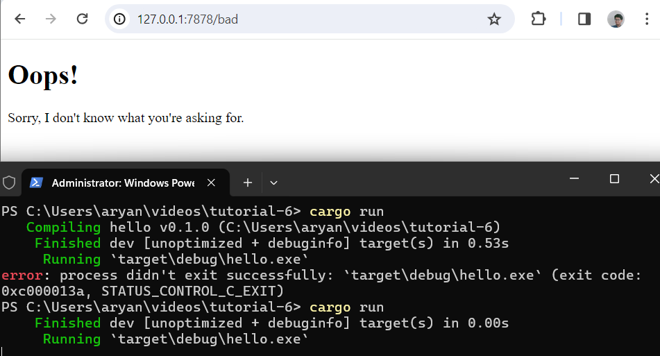

# tutorial-6

### Commit 1 Relflection
#### Fungsi `handle_connection`

Fungsi `handle_connection` bertujuan untuk menangani koneksi TCP yang masuk dari pengguna melalui method `main` sebelumnya.  Fungsi ini adalah menerima argumen `mut TcpStream` yang merepresentasikan koneksi dengan pengguna. `mut` berguna untuk memodifikasi streamnya (atau dalam kasus ini membaca data). Fungsi ini kemudian embuat `BufReader` yang akan membuat `TcpStream` menyediakan pembacaan data yang efisien dan terbuffer. `BufReader` meningkatkan kinerja dengan mengurangi jumlah panggilan sistem yang diperlukan untuk membaca potongan kecil data sekaligus. `BufReader` membaca setiap baris dan mengumpulkannya ke dalam sebuah vektor hingga menemukan baris kosong, yang kemungkinan menandakan akhir dari permintaan HTTP. Terakhir fungsi ini Mencetak seluruh vektor baris permintaan untuk debugging atau tujuan logging.

### Commit 2 Relflection
Pada perubahan dari fungsi `handle_connection` dari sebelumnya, awalnya fungsi ini masih membaca HTTP request dengan `BufReader`. Selanjutnya fungsi ini mendefinisikan `status_line` dengan respon HTPP 200 OK menandakan respons yang sukses. Kemudian fungsi ini membaca konten file HTML sesuai dengan file path yang ada dalam `contents`. Panjang `contents` dihitung, yang diperlukan untuk header Content-Length dalam respons HTTP. String respons HTTP yang diformat dibuat, yang mencakup baris status, header `Content-Length`, dan konten file HTML. Terakhir, respons ini dikirim kembali ke klien menggunakan `stream.write_all`. Jadi pada perubahan fungsi `handle_connection` ini, fungsi tidak hanya membaca request HTTP yang ada tetapi juga memberikan respons.

### Commit 3 Relflection
Pada commit 3 ini, terdapat perubahan pada kode yang telah dibuat. Sekarang terdapat response splitting dibandingkan sebelumnya. Jika pada awalnya kode akan menangani langsung setiap permintaan menuju suatu file html. Sekarang, terdapat 2 bagian yang dipecah. Jika permintaan sukses maka akan metujuk ke hello.html. Sementara jika permintaan gagal atau dengan status 404 NOT FOUND akan merujuk ke 404.html.

Kebutuhan refactoring untuk memisahkan penanganan kode ini dipelrukan untuk membuat kode lebih dinamis. Refactoring selanjutnya akan terus dibutuhkan juga untuk meningkatkan kejelasan dan mempermudah modifikasi pada kode. Dengan pemisahan respons seperti yang sudah kita buat, kode akan menjadi lebih mudah untuk dimengerti dan dipelihara.
